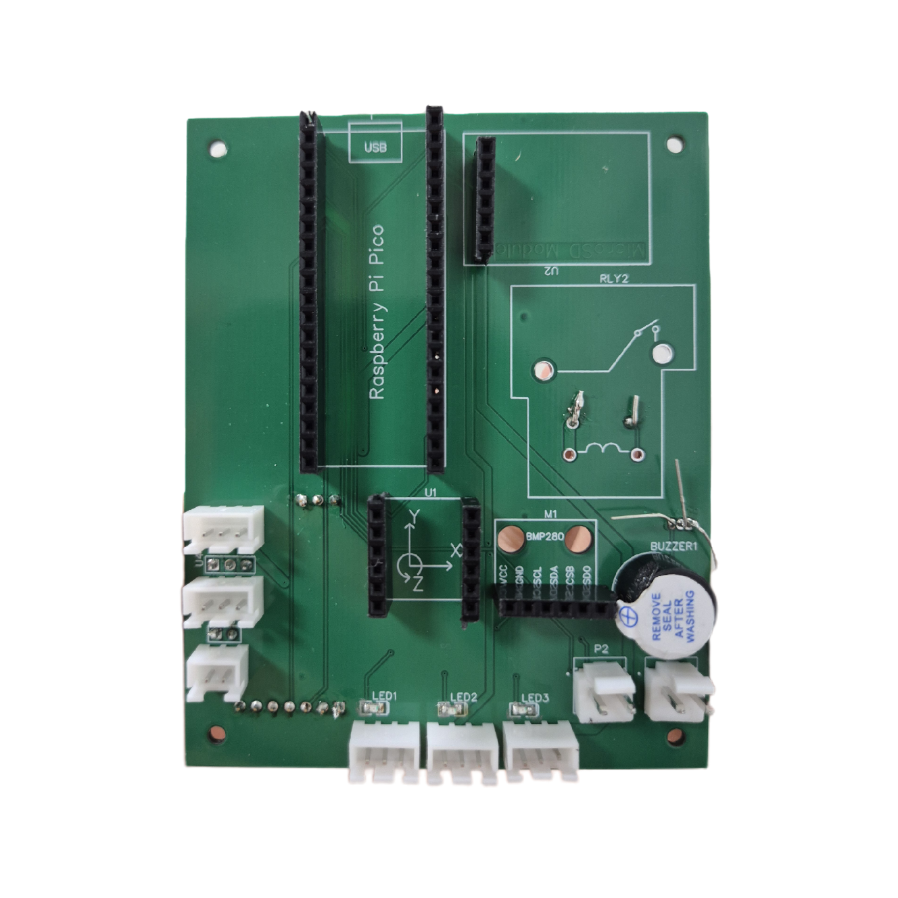
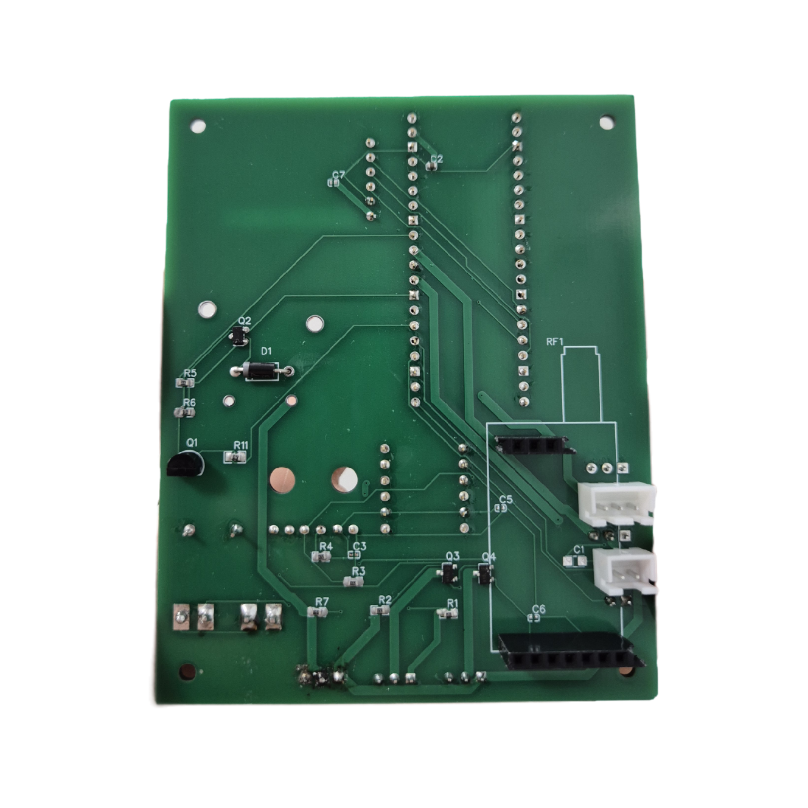
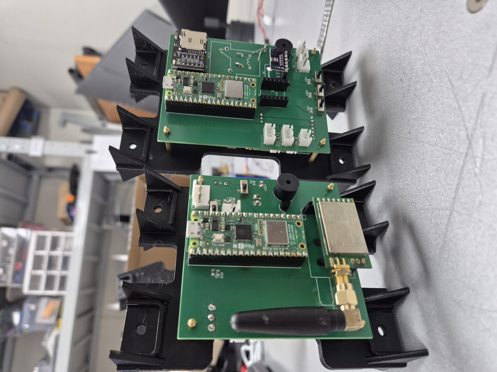
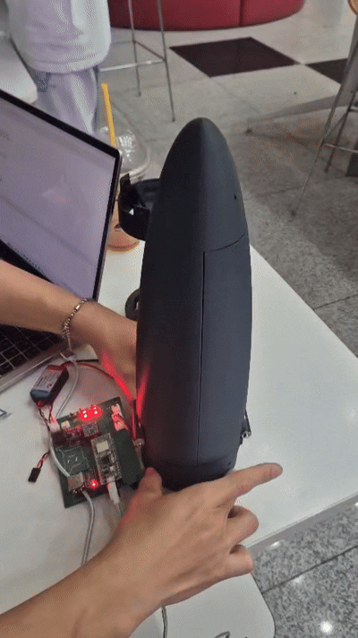
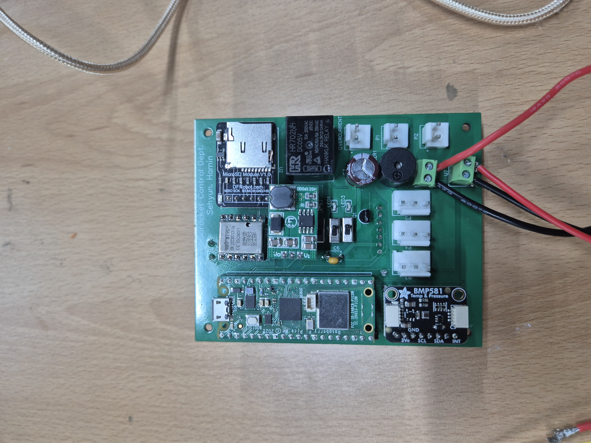
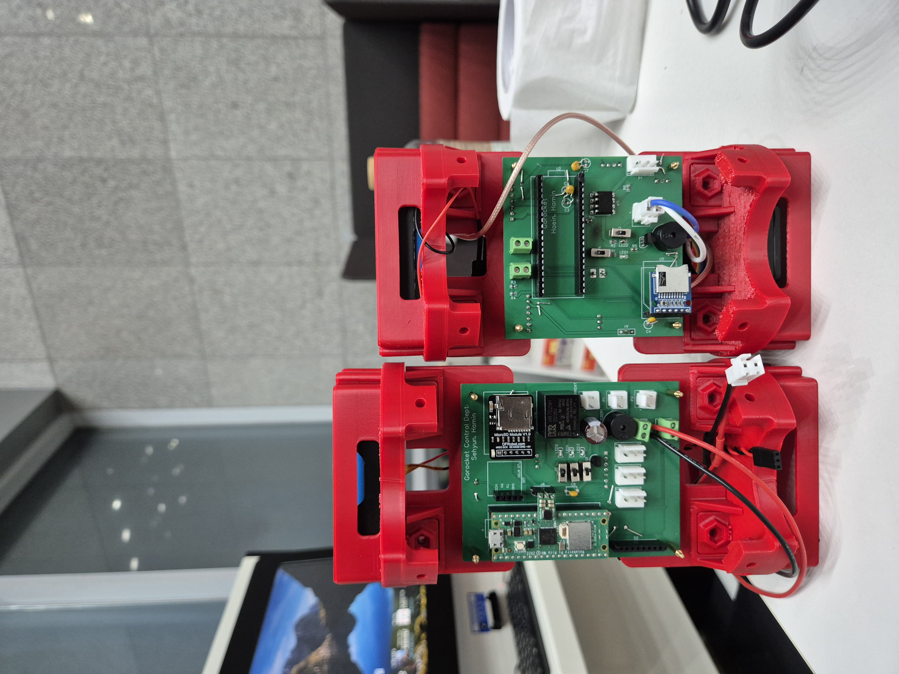

# ANAM-VII — Second-Stage Avionics

Flight avionics for the second stage of **ANAM-VII**, a two-stage sounding rocket built by
**GOROCKET**, the Korea University rocketry team, for the NURA national collegiate rocketry
competition.

The board handles altitude sensing, launch detection, second-stage ignition, parachute and
CanSat deployment, onboard data logging, and a LoRa telemetry downlink used during ground
testing.

Two revisions flew during the 2026 test campaign. **Revision 1 suffered a premature
second-stage ignition on the launch pad.** Revision 2, built around the root-cause analysis of
that failure, flew successfully. This repository documents both, including what went wrong and
why the fix was designed the way it was.

**Role:** second-stage avionics lead — schematic capture, PCB layout, bring-up, failure
analysis, and the Rev 2 redesign.

---

## System overview

| | Revision 1 (June 2026) | Revision 2 (July 2026) |
|---|---|---|
| MCU | Raspberry Pi Pico (RP2040) | Raspberry Pi Pico (RP2040) |
| Firmware | MicroPython, single file | **MicroPython, modular (HAL / config / storage split)** |
| Barometer | BMP280 | **BMP581** |
| IMU | WT901 (9-axis, UART) | WT901 (9-axis, UART)¹ |
| Telemetry radio | E32-433T20D (LoRa, 433 MHz) — not flown | E32-433T20D (LoRa, 433 MHz) — not flown |
| Storage | microSD module (SPI) | microSD module (SPI) |
| Actuators | 3 × MG996R servo | 3 × MG996R servo |
| Ignition switching | AO3400 MOSFET + SLA-5VDC-SL-A relay | AO3400 MOSFET + **HR702-NH-DC5V relay** |
| Isolation | **none** | **4 × 6N137 optocoupler** |
| Umbilical sense | GPIO, no external pull-up | **GPIO with external pull-up to 3V3** |
| Umbilical connector | 2.54 mm pin header | **HT3.96 screw terminal** |
| Logic rail | 1 × 18650 (3.7 V) → Pico | 1 × 18650 (3.7 V) → Pico |
| Actuator rail | 2 × 18650 in series (7.4 V) → UBEC → 5 V | 2 × 18650 in series (7.4 V) → UBEC → 5 V |
| 5 V for SD / buzzer | taken from the UBEC rail | **dedicated 3.3 V → 5 V step-up converter** |
| Board | 2-layer, 80 × 100 mm | 2-layer, 80 × 100 mm |
| Reverse-polarity protection | 2 × AO3401 P-MOSFET | removed (see below) |
| Outcome | premature pad ignition; parachute did not deploy | **nominal flight** |

¹ The Rev 2 schematic in this repository specifies a **WT61**. The ordered WT61 units did not
arrive before the build, so the board flew with a spare **WT901** left over from Rev 1. The two
WitMotion modules share the same UART interface and pin order, so the substitution was a
drop-in; the schematic symbol was never updated to match. Firmware targets the WT901.

### Telemetry

https://github.com/user-attachments/assets/9d17571c-7b28-4119-b0b4-41e68246e9f8

*Ground station receiving live telemetry over the LoRa link during a bench test.*

### Power architecture

Both revisions run two independently switched battery rails, each with its own arming switch, so
avionics logic can be brought up and verified before any high-current load is live.

| Rail | Source | Feeds |
|---|---|---|
| VCC1 — logic | 1 × 18650 Li-ion (3.7 V) | Pico VSYS → onboard regulator → 3V3 logic, sensors |
| VCC2 — actuator | 2 × 18650 in series (7.4 V) → UBEC → 5 V | 3 × MG996R servos, ignition relay coil |

The servo rail is the noisiest node on the board. An MG996R draws several amps at stall, and
three of them commanded simultaneously sag the UBEC output far enough to matter — so firmware
staggers servo commands by 250–300 ms at initialisation and at CanSat release rather than driving
them together.

**Rev 2 added a third rail, as a direct consequence of the isolation.** Once the optocouplers
separated actuator ground from logic ground, the 5 V loads that sit on the *logic* side — the
microSD module and the buzzer — could no longer be fed from the UBEC output without shorting the
two ground domains back together and defeating the isolation. A **3.3 V → 5 V step-up converter**
off the Pico's 3V3 rail supplies them, referenced to logic ground. The 5 V rail has to exist
twice, once per domain; that is part of the price of isolating.

The boot chirp doubles as a check on that converter. It is the first thing the main program does,
before any sensor is touched, so hearing it confirms that the Pico, the buzzer and the logic-side
5 V rail are all alive — and hearing nothing localises the fault before initialisation has had a
chance to fail for some other reason.

### Functional chain

```
                    logic ground          ┊       actuator ground
BMP581 (I²C) ─┐                           ┊
              ├─→ RP2040 ─→ decision ─→ 6N137 ─→ AO3400 ─→ relay ─→ igniter
WT901 (UART) ─┤        │                  ┊
              │        ├──────────────→ 6N137 ─→ servo 1   parachute (nose cone splits laterally)
umbilical ────┘        ├──────────────→ 6N137 ─→ servo 2  ┐ CanSat rotary door
                       ├──────────────→ 6N137 ─→ servo 3  ┘
                       │                  ┊
                       ├──→ microSD  (flight log)
                       ├──→ buzzer   (state / diagnostic tones)
                       └──→ E32 LoRa (populated both revisions; see note)

  left of the 6N137 column:  VCC1 (3.7 V) + 3.3→5 V converter, logic ground
  right of it:               VCC2 (7.4 V) → UBEC 5 V, actuator ground
```

> **Telemetry note — the downlink was built but never flown.** The E32 is populated on both
> boards. Rev 1 firmware contained no radio code at all. For Rev 2 the team built the entire
> chain — vehicle transmitter, a dedicated receiver board, and a PySide6 ground-station
> dashboard — and took it through ground testing successfully. It was then removed from the
> flight build, because **the 433 MHz band the E32-433T20D operates in is not available for
> unlicensed use in Korea.** The removal was regulatory, not technical.
>
> Consequently every telemetry log in the repository is ground-test data; the only in-flight
> record is the onboard SD log. Anyone reusing this design needs a module in a band that is
> licence-exempt where they intend to fly. The wire protocol and the ground-station software are
> independent of the radio module and carry over unchanged. Both the telemetry-enabled build and
> the flight build are preserved in the firmware repository.

---

## Revision 1 — pad anomaly

### What happened

During launch-pad installation, the second-stage avionics concluded that launch had occurred
while the vehicle was still on the pad. The second stage ignited on the rail.

Two independent failures occurred on this flight:

1. **Electrical — false launch detection.** The safety-pin umbilical stopped conducting during
   pad setup. The launcher-tie umbilical remained connected and behaved normally. Launch
   detection rested entirely on the two umbilical lines, with no debounce and no independent
   confirmation, so degraded contact on that interface was sufficient to start the flight
   sequence.
2. **Mechanical — parachute failed to deploy.** The nose cone opened correctly and the
   parachute was exposed to the airstream, but the shroud lines were tangled and the canopy
   never inflated. The CanSat ejected normally and its parachute deployed as designed.

The two failures are unrelated and were addressed separately.

### Root cause of the false launch detection

Three design decisions combined:

**1. No persistence, agreement, or reversion on launch detection.** Firmware advanced on
umbilical edges with no debounce whatsoever: STAGE 1→2 the instant the safety line read
disconnected, STAGE 2→3 the instant the launcher-tie line did. Every transition was latched —
nothing walked the state machine back if a line came good again. Momentary loss of contact on
the two lines in turn, or induced noise on the floating sense nodes, was therefore enough to
reach STAGE 3. From there ignition was a bare timer — first-stage burnout detection, or 8 s
after the STAGE 3 transition, whichever came first — with no altitude check, no independent
sensor agreement, and no abort path.

**2. High-impedance umbilical sense node.** The umbilical connectors were wired pin 1 to GND,
pin 2 to a GPIO, with no external pull-up. When the umbilical is detached the node is left
floating and held only by the RP2040's internal pull-up, which is weak (tens of kΩ). Umbilical
runs are long and effectively act as antennas, and they sit alongside servo and relay switching
transients. An intermittent contact or induced noise on that node is indistinguishable from a
genuine detach event.

**3. Connector choice.** The umbilicals broke out to bare 2.54 mm male pin headers. A 0.1 in
header mated with a friction-fit socket has no positive latch and low retention force, and its
contact resistance degrades with repeated mating and handling — a poor choice for an interface
whose entire purpose is to be pulled apart reliably, and to stay connected until it is.

Note that the ignition path itself was **not** unguarded. Rev 1 already required two conditions
in series — an external arming switch feeding the relay coil high side, and the MCU asserting
the ignition GPIO into the coil low-side MOSFET — so software alone could not fire the igniter.
The failure was that once firmware wrongly concluded "launched," the only remaining barrier was
procedural: the arming switch had already been closed as part of pad setup.

### Also found in Rev 1

Schematic review after the flight showed `SERVO2` routed to **pin 30 (RUN)** of the Pico, which
is the reset input rather than a GPIO. This was worked around on the physical board with a patch
wire during assembly, landing the signal on **GP15** — the pin Rev 1 firmware actually drives.
It is corrected properly in Rev 2.

### The Rev 1 board

| Front | Back |
|---|---|
|  |  |

*Connector spacing left too little clearance, so parts intended for the top layer had to be
alternated between both sides during assembly. The patch wire carrying `SERVO2` off pin 30 (RUN)
to GP15 is visible on the back.*



*First- and second-stage avionics on the airframe mount, June configuration.*

### Parachute deployment mechanism



*Ground deployment test. The nose cone splits laterally into two halves rather than ejecting,
giving a larger effective aperture for the canopy. On the June flight this mechanism worked as
designed and exposed the parachute to the airstream — the canopy still failed to inflate,
because the shroud lines were tangled.*

---

## Revision 2 — changes and rationale

### Launch detection

Rev 1 walked its state machine on umbilical edges alone. Rev 2 splits the decision into two
independent gates.

**Launch recognition** now requires *both* umbilicals to read disconnected simultaneously, held
for 1 s of debounce, before the vehicle is considered launched. If either line reconnects during
that window the state machine reverts to ground-idle. Rev 1 had no debounce, no agreement
requirement, and no path back once the sequence had started.

**Ignition** is gated separately, on an independent sensor: the barometer must be healthy *and*
report at least 10 m of altitude gain before ignition is permitted at all. A stuck or noisy
umbilical line therefore cannot reach the igniter — at most it advances the flight state, which
on the pad still fails the altitude gate. The barometer was upgraded from BMP280 to **BMP581**
for the lower noise floor and finer resolution this threshold demands.

### Umbilical sense hardening

- **4.7 kΩ pull-up resistors to 3V3** added on both umbilical sense lines, replacing reliance on
  the RP2040 internal pull-up. At roughly 0.7 mA the sense node is now held at a defined logic
  level with an order of magnitude lower source impedance, making it far less susceptible to
  induced noise.
- **Connectors changed from 2.54 mm pin headers to HT3.96 screw terminals** on both umbilicals,
  after the header contacts were judged to be the physical failure point. A screwed conductor
  cannot back out under handling, and the mating force now comes from the umbilical lanyard
  rather than from a friction fit.

### Galvanic isolation

All four MCU control lines that drive high-current loads now pass through **6N137 high-speed
optocouplers** — one per servo channel and one on the ignition line:

- Input side: 271 Ω series resistor from the 3.3 V GPIO (≈12 mA LED drive)
- Output side: 1 kΩ pull-up to the 5 V actuator rail

The **grounds of the servo and ignition domains are separated from the MCU ground.** Servo
stall currents and igniter firing current no longer share a return path with the logic ground,
so switching transients on those loads cannot disturb the MCU's ground reference. Rev 1 had no
isolation of any kind.

Two things follow from this that are easy to miss when specifying the change. The 5 V rail has to
be duplicated per ground domain, which is what the added 3.3 V → 5 V converter is for (see
[Power architecture](#power-architecture)). And every isolated line arrives at its load inverted,
which is a larger problem than it first sounds.

### Inverted drive, and the boot window it created

The 6N137 is an inverting stage: GPIO high turns the LED on, which pulls the optocoupler output
low. Every isolated line therefore arrives at its load inverted, and two consequences follow.

**Ignition became active-low.** GP27 high means relay off. That is the correct sense to design
toward — but it also means that a pin left in its power-on default (input, high-Z) lets the 1 kΩ
pull-up hold the optocoupler output high, closing the relay. **The isolation added to prevent a
premature ignition introduced a new window in which one could occur: the interval between power
being applied and firmware taking control of the pin.** This was addressed on three levels:

- **Firmware.** `boot.py` runs ahead of the main program and does nothing but force the safe
  state — GP27 high (relay off), the three servo lines high (no pulse, servos limp), buzzer off.
  It is deliberately the shortest file on the board.
- **Procedure.** The gap between power-on and `boot.py` cannot be closed in software, so the
  ignition arming switch stays open until the board has finished initialising and sounded its
  init-complete tone. Arming is the last step of pad setup, not the first.
- **Hardware.** The two-condition interlock below still stands behind both.

**Servo PWM had to be inverted too.** A standard servo wants a 1–2 ms positive pulse, so the
GPIO must emit its complement — a high baseline with a short low pulse. Getting this backwards
silently commands the opposite end of travel, which for a deployment servo means the mechanism
either releases on the pad or never releases at all. Rather than leave that to be re-derived at
each call site, the inversion is confined to a hardware-abstraction layer: the flight logic only
ever calls `servo.release()` or `igniter.on()`, and no other module is permitted to touch a PWM
or GPIO on an isolated line.

### Ignition switching

The relay was changed to the physically smaller **HR702-NH-DC5V**. The two-condition interlock
is retained — external arming switch on the coil high side, MOSFET on the low side, with the
gate held off by a 10 kΩ pull-down and driven through a 100 Ω series resistor, and a 1N4007
flyback diode across the coil. Firmware drives the line as a bounded 3 s pulse rather than a
level, so a hung flight loop cannot hold the igniter energised.

### Firmware interlocks

The Rev 2 flight logic is a five-state machine with the ignition and deployment guards stated as
explicit, tunable constants rather than inline conditions. Beyond the launch and altitude gates
already described:

- **Tilt abort.** Attitude is tracked by integrating the two lateral gyro axes from the launch
  instant. Sustained tilt beyond 45° for 0.3 s inhibits ignition entirely and deploys the
  parachute immediately. The check arms 2 s after launch so that rail departure cannot trip it.
- **CanSat inhibit after an abort.** If the parachute came out on a tilt abort, CanSat separation
  is suppressed — an off-nominal attitude is not a state to release a second body into.
- **Barometer-failure timer.** If the barometer is unhealthy, ignition is never permitted and the
  parachute deploys at launch + 15 s.
- **Absolute backstop.** Regardless of state, sensor health or detected events, the parachute
  deploys no later than launch + 20 s.
- **Brownout recovery.** Flight state is checkpointed to SD every 200 ms across two alternating
  slots, each with a sequence number and checksum, written in place into a pre-allocated
  fixed-size file. On boot the higher valid sequence is adopted, so a power interruption mid-
  flight resumes the sequence instead of restarting it. Checkpoints are discarded if both
  umbilicals are found connected at boot, which means the vehicle is on the pad rather than
  recovering.
- **Fault containment.** Each pass of the flight loop is individually guarded, so a sensor or
  filesystem exception costs one iteration rather than the flight. Logging runs at 50 Hz with a
  periodic flush and re-open, bounding data loss on abrupt power removal to about half a second.

### Reverse-polarity protection removed

Rev 1 carried two AO3401 P-MOSFETs for reverse-polarity protection, one on each battery input
(3.7 V and 5 V). These were dropped in Rev 2: the JST VH battery connectors are mechanically
keyed and cannot be mated backwards, making the MOSFETs redundant against the failure they
guarded. The parts were also out of stock at build time, and the team judged a re-order
unwarranted.

The residual risk is a battery harness crimped with reversed polarity, which connector keying
does not catch. That is handled as an assembly-checklist item rather than in hardware.

### Pin assignment and schematic hygiene

- `SERVO2` moved off **pin 30 (RUN)** to **GP22**, eliminating the Rev 1 patch wire; `SERVO3`
  moved from GP22 to **GP21** to make room.
- Umbilical sense assignments re-derived from the schematic net names so that firmware constant
  and net label agree: safety on **GP18**, launcher-tie on **GP19**. Rev 1 firmware used the
  opposite pair; the harness was mated to match, so both revisions behaved as intended, but the
  two codebases are not interchangeable on this point.
- All unused pins explicitly marked no-connect.

### Layout

On Rev 1 the connector footprints were spaced too tightly. Parts intended for the top layer did
not fit and had to be alternated between top and bottom during assembly, which made the board
awkward to build and to service. Rev 2 increased inter-component clearance and reworked
placement so connectors sit on accessible edges, with the ground pours split to match the
isolated-domain topology.



*Rev 2. The four 6N137 optocouplers isolating the three servo channels and the ignition line;
connectors relocated to accessible board edges, with clearance sufficient to populate the top
layer as intended.*



*First- and second-stage avionics on the airframe mount, July configuration.*

### Result

Rev 2 flew nominally in the second test launch, July 2026.

---

## Repository contents

```
hardware/
  rev1/                  schematic and PCB (June 2026 flight configuration)
  rev2/                  schematic and PCB (July 2026 flight configuration)
docs/
  failure-analysis.md    Rev 1 pad anomaly write-up
  images/                board photos and deployment-test footage
```

Designed in **EasyEDA**.

Software lives in a separate repository, organised by launch — Rev 1 firmware, the Rev 2 flight
build, the telemetry-enabled build it was derived from, first-stage firmware, the receiver-board
firmware, the PC ground-station dashboard, bench scripts and ground-test logs:
**[anam-vii](https://github.com/rexkim1020/anam-vii)**

---

## Notes

This is student competition hardware, not a qualified flight system. The Rev 2 interlock and
launch-detection changes were reviewed within the team before flight; anyone reusing this design
should treat the ignition and arming sections as a starting point for their own safety review,
not as a validated reference.

Rev 1 and Rev 2 were team efforts. This repository documents the second-stage avionics
subsystem, which was my responsibility; propulsion, structures, and recovery hardware were owned
by other sections of GOROCKET.
